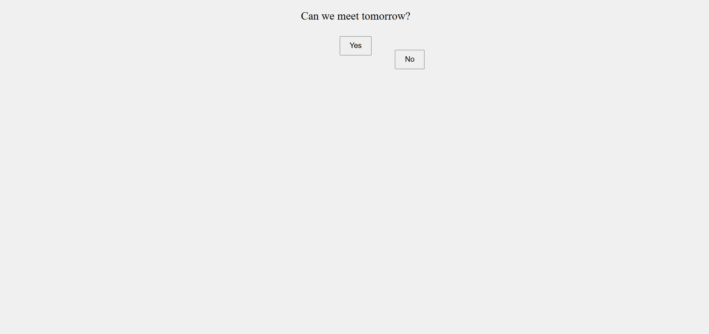

# 😂 Can We Meet Tomorrow? – Funny Button App

A light-hearted, humorous mini-app built with **HTML**, **CSS**, and **JavaScript**. The app asks, *“Can we meet tomorrow?”*, but when you try to click “No” — it floats away! A fun project showcasing interactive front-end behavior and basic animation logic.

## 🚀 Live Demo

👉 [Live App](https://byzaheer.vercel.app/)

## 🛠️ Tech Stack

- **HTML5**
- **CSS3**
- **Vanilla JavaScript**

## ✨ Features

- Playful “Yes/No” interaction
- Floating button animation on hover
- Minimal and humorous UI
- Responsive and lightweight

## 📚 Ideal For

- UI/UX animation practice
- Fun mini-projects
- JavaScript DOM manipulation
- Engaging user interaction demo

## 📫 Contact Me

- **📧 Email:** muhdzaheermv@gmail.com  
- **🔗 Portfolio:** [https://portfolio-lilac-eight-60.vercel.app/](https://portfolio-lilac-eight-60.vercel.app/)  
- **💼 LinkedIn:** [https://www.linkedin.com/in/muhammed-zaheer-836132244/](https://www.linkedin.com/in/muhammed-zaheer-836132244/)

## ⭐ Like This Project?

If this little project made you smile or inspired you to build your own fun app, go ahead and **⭐ star** the repo — spread the joy!

